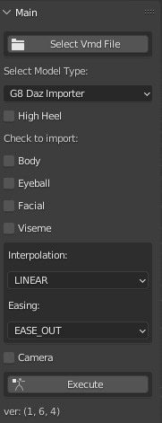
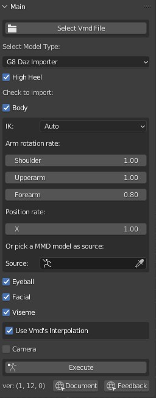
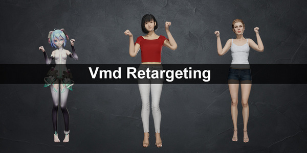
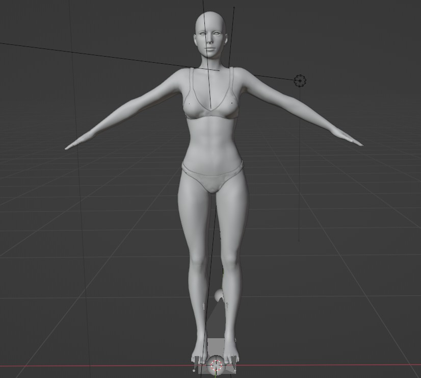
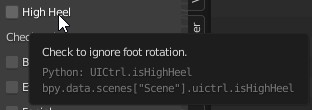
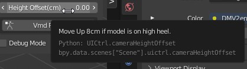
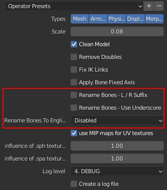
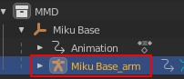
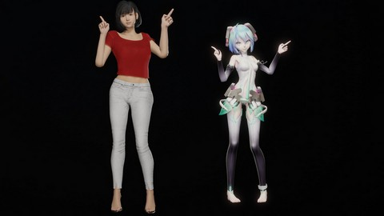
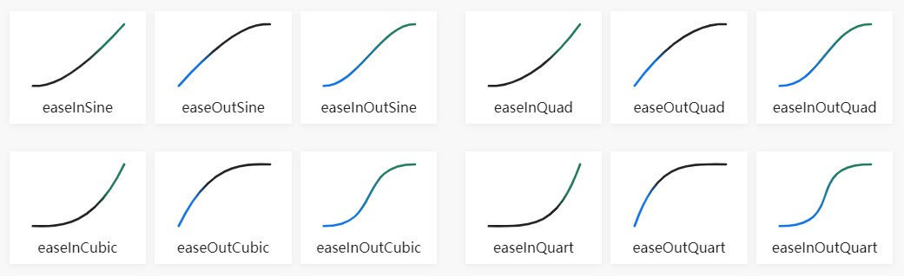

### Notice: If you already bought it, make sure you update it to latest version. Which fixed some important bugs and added support for Blender 3.1. Also handled twist bones, for Natsumi San's vmd motion   

# Language
[中文](Readme.cn.md)  
[日本語](Readme.jp.md)

# Blender Addon: Vmd Retargeting
This blender addon will import motion from mmd's .vmd file onto Daz or CC3 models, with or without mmd model.  

 

# Demo Video
[https://youtu.be/Xgfu8oSjUUs](https://youtu.be/Xgfu8oSjUUs)  
  

# Tutorial Video
[https://youtu.be/li7yjJKbbgI](https://youtu.be/li7yjJKbbgI)  

# Info
### Download
[https://blendermarket.com/products/vmd-retargeting](https://blendermarket.com/products/vmd-retargeting)

### Blender Forum
[https://blenderartists.org/t/addon-retarget-mmds-vmd-motion-to-daz-or-cc3/1361902](https://blenderartists.org/t/addon-retarget-mmds-vmd-motion-to-daz-or-cc3/1361902)

### Github
This github repo is for issues and translation.  
[https://github.com/butaixianran/Blender-Vmd-Retargeting](https://github.com/butaixianran/Blender-Vmd-Retargeting)

### Version
Addon: 1.6.3  
Blender: 3.0 or later

# Feature
* Import motion from vmd file without a mmd model
* Or retarget body motion from a mmd model.
* 
* Import body, eyeball, facial, viseme and camera motion separately
* Ignore feet rotation when Daz/CC3 character is on high heel.
* Set interpolation and easing as you wish
* Set arm rotation rate, to prevent hands poke into chest.  
* Set camera height offset or rotation rate if needed  

# Install
* Install the .zip file you get from online shop.  
* Search "Vmd retargeting" in your addon list and enable it
* In viewport, press "N" to display tool panels, select "Vmd Retarget" panel  

If you are new to blender and don't know how to install a blender addon, search: "blender install addon" in google.  

# How to use
## Prepare a character
This addon supports:
* Daz Genesis 8 imported by [diffeomorphic daz importer](https://diffeomorphic.blogspot.com/)
* Daz Genesis 8 imported by [Official Daz to Blender Bridge(updated version for blender 3.x)](https://github.com/butaixianran/DazToBlender)  
* CC3(Character Creator) model imported by [cc3 blender tools addon](https://github.com/soupday/cc3_blender_tools)  

For characters imported by fbx, cc3 model works too. But for daz model, facial and viseme motion won't work.  

### Prepare CC3 model
**No preparing is needed.**   
Just export it from Character Creator, not from iClone.  

When exporting from CC, make sure you choose A-Pose.(Need CC3+)  
    
After importing into Blender, its pose should be like this:    
  

### Prepare Daz model(with Diffeomorphic Daz Importer)
[Diffeomorphic daz importer](https://diffeomorphic.blogspot.com/) is complex. But we just need click a few buttons to get it done.  

You need to know the basic of how to setup and export a daz model for Diffeomorphic daz importer.
Check its official tutorial for that.  

And when importing model to blender, you need 3 things:
* Merge all armatures into body's armature
* Face Unit morph and Viseme morph
* Make all bones poseable.  

**The easiest way for these, is importing a character by click "Easy Import Daz" button.**  
By default, it already checked Merge Rigs for you.  
So, you just need to check "Face Units" and "Visemes", then import.  

After importing, go to "**Finish**" section of Diffeomorphic daz importer's panel. Click "**Make All Bones Poseable**"

Now, your daz model is prepared.  

### Prepare Daz model (with Official Daz to Blender Bridge(DTB))
This is for those who know how to use DTB. If you are not familiar with Daz or Blender, just choose the "Diffeomorphic Daz Importer" way.  

The good part of DTB is, morph is on body mesh's shape key without driver. Also, there is no complex shader in material, only standard Principled shader.   

So, you can export this Daz model with motion and material from Blender to any other 3D tools, including game engine.  

If you don't know how to use DTB, you need to read the installation part of its doument:  
[https://github.com/butaixianran/DazToBlender](https://github.com/butaixianran/DazToBlender)  

Also watch Daz Official tutorial:  
[https://www.daz3d.com/daz-to-blender-bridge](https://www.daz3d.com/daz-to-blender-bridge)  

**After you installed DTB:**   
* In Daz, when exporting your model, check "**Include Morphs**"
* Go to "**choose morphs**" dialog window, click **Genesis 8 Facial Morphs** and **Visemes** Buttons on the left to add those morphs into export list.  
* Export.  
* In Blender, on DTB's panel, click import, Done.

## Prepare a vmd file
**No preparing is needed in most cases.**  

But, there are some old or weird vmd files don't use normal bone names or file structure.  

If you imported a vmd file like this onto Daz or CC3, your model gonna jump from one pose to another, like a robot dance.  

For those vmd files, just open MikuMikuDance, load a TDA model, and load this vmd file on it, then re-export it as a new vmd file.  

This new vmd file will work.

## Import vmd
It is pretty simple:
* Select your character's armature
* Select a vmd file
* Select your model type (G8 by Differ Daz Importer, G8 by Official Daz Bridge or CC3)
* Check which part you'd like to import
* **Make sure** your active armature is your Daz or CC3 model, click "Execute", done.

Each part will be an action wrapped into a strip on a track, in NLA (Nonlinear Animation).  
So, it won't mess up your timeline, and you can move or delete them like clips.

## Options
Move your mouse onto those operators (button, checkbox or list), will display a useful tooltip.  

High Heel Tooltip:  
  

Camera Height Offset Tooltip:  
  

### High Heel
check to ignore rotation on feet.  

### Body Motion
#### Tracks
Body motion is separated into mutiple tracks.  

For example, mmd doesn't have motion layers, so they use mutiple bones which does the same thing, to simulate motion layers. And we handle that by adding this bone's motion into a real new layer.

For now, we only do this for: center and groove bone.  

#### IK
**If a vmd motion does not use IK, just uncheck it**.   
If a vmd motion does not use IK, but you checked IK when importing, since there is no IK data, character's legs won't move. So, just uncheck IK when importing.   

After unchecked IK, there will be a "Position Rate X" option shows up. Set it to 0.5 can make feet slip less.  

**IK works fine in most cases. But if leg rotates widely, then you need to know following information:**  

CC3 and Daz model don't have IK by default. So this addon creates IK for legs when importing body motion from vmd file.  

But a problem with Daz/CC3 model is: there is no bending on their knees' rest pose. In that case, IK will come with a IK Pole Bone, to tell knee which direction to point when bending.  

So, Daz/CC3's knees are always pointing to IK Pole bones in front of them. And IK Pole Bones are following rotation of pelvis bone.  

That works fine in most cases. But, if legs rotate too much, then IK Pole bones won't work well since they just following pelvis bone.  

So, in that case, you need to retarget motion from a mmd model. Since mmd model already has the motion on it, your Daz/CC3 model can get legs' final rotation without IK bone.  

Check the section: **Pick a mmd model as Source**

#### Arm rotation rate
Daz/CC3 has different arm length with mmd model. So, if mmd model puts hands on chest, they always poke into body when on Daz/CC3 model.

Set upperarm and forearm rotation rate to 0.8 will fix that in most cases. (Now this is default)  

But if you are using CC3 model, you better set it back to 1.0.    

#### Pick a mmd model as Source
If you picked a mmd model, addon will ignore body motion from vmd file and retarget body motion from your picked mmd model.  

Eyeball and morph motion are still loaded from vmd file.  

You need blender mmd tools to import a mmd model into blender:  
[https://github.com/UuuNyaa/blender_mmd_tools](https://github.com/UuuNyaa/blender_mmd_tools)  

**When importing a mmd model, uncheck rename bones!** We use its japanese bone name to map bones.    
  

After importing mmd model, then import your vmd motion onto this mmd model **by using mmd tools, not this addon!**   

Which is: select your mmd model, go to `File menu->Import->Vmd file`, and select a vmd file.  
Now, your mmd model should has a motion on it.   

Then select your Daz or CC3 model, use the pick tool of "Source" from this addon's panel, **pick the armature of your mmd model. Not the empty parent!**    
  

**Make sure you select your Daz or CC3 model**, then click "Execute".    

It will retargeting every frame of evey mapping bone's final rotation from mmd model, not just key frames, so it will be very slow.   

And it doesn't need an IK bone on Daz/CC3 model.  

**There is a video tutorial for this:**   
[https://youtu.be/rttA3v_5S2I](https://youtu.be/rttA3v_5S2I)  
  

### Eyeball/Facial/Viseme
CC3 doesn't come with viseme morphs, it's a feature for iClone. So, this addon uses facial expression morphs to simulate viseme. It is ok, but won't as good as real viseme morphs, and it won't move teeth.  

### Interpolation/Easing:
You can find examples from [https://easings.net/](https://easings.net/)  

  

If your model's motion is not smooth, you can try set interpolation to "Linear". In some cases, linear is pretty smooth.  

This setting won't affect camera motion. Camera motion is always linear.  

### Camera Rate/ Height Offset
Daz/CC3 model has different model size with mmd model. So, camera motion need to be adjusted.  

Default value works fine for almost every case. 
But if your model is a CC3 character with high heel, you need to move camera up with 8cm.  

### Debug mode
Debug mode will print down everything in console log. It gonna slow down the retargeting a lot.  

So only check it when importing a vmd file with a single pose.

# Limits
## Shoulder Rotation
There are 3 shoulder bones on a mmd model: shoulder, shoulder P, shoulder C. This addon ignored shoulder P and shoulder C.  

## Twist Bone
MMD model also comes with twist bones, only a few vmd motions use them. With Daz Model, this can be converted nicely. But CC3 model's twist bones work in a different way and won't be converted well.   

So, if you are using a vmd file come with motion on twist bones, you better use Daz model.  

So far as I know, only Natsumi San's vmd motion uses twist bones.   

## Waist Bone
Mmd's Waist Bone, is the parent of upper body and lower body. Which makes it can turn the whole body together, like a hip bone.   

There is No other Character model treat Waist Bone that way. So, we convert Waist Bone's data into lower spine bone.

Since most vmd motion never uses Waist Bone, it won't be a problem.  

But, again, Natsumi San's vmd motion may use it. Still, as long as vmd motion does not use Waist Bone as hip bone to rotate the whole body, it gonna be fine.     

## Prop motion
This addon won't handle that.

# Common Issue
## shift_jis error
If there is error msg with `shift_jis` in it, it means, this vmd file is not encoded with `shift_jis`.   

You need to open MMD, load a TDA model, load this vmd file and Re-save it into a new vmd file. This new vmd file will be encoded with `shift_jis`. Then import this new vmd file.  

## 'KinematicConstraint' object has no attribute 'enabled'
Your blender version is too old, pls use Blender 3.0 or later.  

## Eye can not be fully closed
MMD model comes with 5 morphs can close eyes. But other character like Daz or CC3 only has one morph to close eye.  

Normally, vmd motion's creator only use 1 of those 5 morphs to close eye, to avoid chaos. But, there are a few vmd motion's creator will play with all 5 morphs.    

In that case, all 5 mmd morphs data is converted into 1 daz/cc3 morph, so one morph's data will cover another, which make eyes can not be fully closed.  

The only solution for this, is remove all other 4 morphs' data in MMD, only keep one of them.  

These 5 morphs are: ウィンク, ウィンク２, まばたき, 笑い, なごみ  

or you can just remove all 5 morphs' data.  

# Update Log:
## 1.6.3
* Set "ぺろっ" and "口角上げ"'s converting rate to 0.5, to make a better smile.
* Handle "shift_jis" error to show a msg.
* Fix an issue that can not import camera when using DTB character.

## 1.6.0
* Support Daz model imported by Official Daz to Blender Bridge:
[https://github.com/butaixianran/DazToBlender](https://github.com/butaixianran/DazToBlender)  

## 1.5.0
* Convert twist bone and Waist bone

## 1.4.1
* Support Blender 3.1
* Add shoulder rotation rate

## Older
* Set Arm rotation rate to 0.8 as default, since every vmd motion put hands to chest.
* Add shoulder rotation rate then remove it, seems not very useful.
* Add IK checkbox, uncheck to not create IK bones.
* Handle rotation for center bone
* Remove leg's rotation when importing from vmd file since IK takes control
* Fix feet rotation when retargeting from mmd model
* Arm rotation rate now works when retargeting motion from a mmd model
    - This is done by using a new way to convert mmd model's upper body motion
* When executing with a wrong model type, now shows a message.