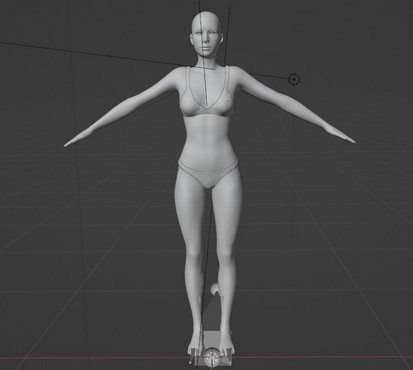
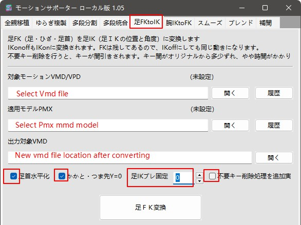
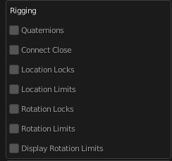

### This addon now is stable and handles most vmd motion very well. So, if you can not make it work, read this document's "[Common_Issue](#Common_Issue)" part to fix your issue quickly.    

# Language
[中文](Readme.cn.md)  
[日本語](Readme.jp.md)

# Blender Addon: Vmd Retargeting
This blender addon will import motion from mmd's .vmd file onto Daz or CC models, with or without mmd model.  

 

# Demo Video
[https://youtu.be/Xgfu8oSjUUs](https://youtu.be/Xgfu8oSjUUs)  
  

# Tutorial Video
[https://youtu.be/li7yjJKbbgI](https://youtu.be/li7yjJKbbgI)  

# Info
### Download
[https://blendermarket.com/products/vmd-retargeting](https://blendermarket.com/products/vmd-retargeting)

### Blender Forum
[https://blenderartists.org/t/addon-retarget-mmds-vmd-motion-to-daz-or-cc3/1361902](https://blenderartists.org/t/addon-retarget-mmds-vmd-motion-to-daz-or-cc3/1361902)

### Github
This github repo is for issues and translation.  
[https://github.com/butaixianran/Blender-Vmd-Retargeting](https://github.com/butaixianran/Blender-Vmd-Retargeting)

### Version
Addon: 1.13.0  
Blender: 3.0 or later  

# Feature
* Import motion from vmd file without a mmd model
* Or retarget body motion from a mmd model.
* 
* Import body, eyeball, facial, viseme and camera motion separately
* Ignore feet rotation when Daz/CC character is on high heel.
* Set interpolation and easing as you wish
* Set arm rotation rate, to prevent hands poke into chest.  
* Set camera height offset or rotation rate if needed  

# Install
* Install the .zip file you get from online shop.  
* Search "Vmd retargeting" in your addon list and enable it
* In viewport, press "N" to display tool panels, select "Vmd Retarget" panel  

If you are new to blender and don't know how to install a blender addon, search: "blender install addon" in google.  

# How to use
## Prepare a character
This addon supports:
* Daz Genesis 8 imported by [diffeomorphic daz importer](https://diffeomorphic.blogspot.com/)
* Daz Genesis 8 imported by [Daz to Blender Bridge for blender 3.x](https://github.com/butaixianran/DazToBlender)  
* Daz Genesis 8 imported by [Official Daz to Blender Bridge 2022](https://www.daz3d.com/forums/discussion/572806/official-daztoblender-bridge-2022-what-s-new-and-how-to-use-it)  
* CC(Character Creator) imported by [cc blender tools addon](https://github.com/soupday/cc_blender_tools)  

  

For characters imported by fbx, cc model works too. But for daz model, facial and viseme motion won't work.  

### Prepare CC3+ or CC4 model
**No preparing is needed.**   
Just export it from Character Creator, not from iClone, and Mesh only, no animation.  

For CC3+, when exporting, choose A-Pose  
    

For CC3+ or CC4, After importing into Blender, its pose should be like this:    
  

### Prepare Daz model(with Diffeomorphic Daz Importer)
[Diffeomorphic daz importer](https://diffeomorphic.blogspot.com/) is complex. But we just need click a few buttons to get it done.  

You need to know the basic of how to setup and export a daz model for Diffeomorphic daz importer.
Check its official tutorial for that.  

And when importing model to blender, you need 3 things:
* Merge all armatures into body's armature
* Face Unit morph and Viseme morph
* Make all bones poseable.  

**The easiest way for these, is importing a character by click "Easy Import Daz" button.**  
By default, it already checked Merge Rigs for you.  
So, you just need to check "Face Units" and "Visemes", then import.  

After importing, go to "**Finish**" section of Diffeomorphic daz importer's panel. Click "**Make All Bones Poseable**"

Now, your daz model is prepared.  

### Prepare Daz model (with Daz to Blender Bridge(DTB) for Blender 3.x)
This is for those who know how to use DTB. If you are not familiar with Daz or Blender, just choose the "**Diffeomorphic Daz Importer**" way.  

This one, is not the Official DTB 2022. It is a version updated by me, which works on Blender 3.x, fixed most issues in the Official DTB, and added a lot of useful options.  
[https://github.com/butaixianran/DazToBlender](https://github.com/butaixianran/DazToBlender)  

The best part of this one is, morph is on body mesh's shape key without driver. Also, there is no complex shader in materials, only standard Principled shader.   

**So, with this one, you can export Daz model with motion and materials from Blender to any other 3D tools, including game engine.**  

**After you installed DTB:**   
* In Daz, when exporting your model, check "**Include Morphs**"
* Go to "**choose morphs**" dialog window, click **Genesis 8 Facial Morphs** and **Visemes** Buttons on the left to add those morphs into export list.  
* Export.  
* In Blender, on DTB's panel, click import, Done.

### Prepare Daz model (with Official Daz to Blender Bridge(DTB) 2022)
Official DTB 2022 is released, with many old bugs and problems in it, never fixed. So, we really recommend you do not use this addon for now.  

For now, the only good part for Official DTB 2022 is, it is very easy to install. But it is not as good as the other 2 choices.    

You can learn it here about how to install or use it:  
[https://www.daz3d.com/forums/discussion/572806/official-daztoblender-bridge-2022-what-s-new-and-how-to-use-it](https://www.daz3d.com/forums/discussion/572806/official-daztoblender-bridge-2022-what-s-new-and-how-to-use-it)  

**After you installed DTB 2022:**   
* In Daz, when exporting your model, check "**Export Morphs**"
* Go to "**choose morphs**" dialog window, From "Pose Controls" category, add **Eyes**, **Mouth**, **Brow**  and **Visemes** morphs to the "**Morphs to Export**" list.  
* Export.  
* In Blender, on DTB's panel, click import, Done.  

## Prepare a vmd file
**No preparing is needed in most cases.**  

But, there are some very old vmd files don't use normal vmd file structure.  

If you imported a vmd file like this onto Daz or CC, your model gonna jump from one pose to another, like a robot dance.  

For those vmd files, just open MikuMikuDance, load a TDA model, and load this vmd file on it, then re-export it as a new vmd file.  

This new vmd file will work.  

## Import vmd
It is pretty simple:
* Select your character's armature
* Select a vmd file
* **Select model type**
* Check which part you'd like to import
* If this vmd motion doesn't use IK, then uncheck IK
* **Make sure** selected object is Daz or CC model, click "Execute", done.

Each part will be an action wrapped into a strip on a track, in NLA (Nonlinear Animation).  
So, it won't mess up your timeline, and you can move or delete them like clips.

## Options
Move your mouse onto those operators (button, checkbox or list), will display a useful tooltip.  

High Heel Tooltip:  
  

Camera Height Offset Tooltip:  
  

### High Heel
check to ignore rotation on feet.  

### Body Motion
#### Tracks
Body motion is separated into mutiple tracks.  

For example, mmd doesn't have motion layers, so they use mutiple bones which does the same thing, to simulate motion layers. And we handle that by adding this bone's motion into a real new layer.

For now, we only do this for: center and groove bone.  

#### IK and IK Pole Bone
**IK works fine in most cases. But if leg rotates widely, then you need to know following information:**  

CC and Daz model don't have IK by default. So this addon creates IK for legs when importing body motion from vmd file.  

But a problem with Daz/CC model is: there is no bending on their knees' rest pose. In that case, IK will come with a IK Pole Bone, to tell knee which direction to point when bending.  

So, Daz/CC's knees are always pointing to IK Pole bones in front of them. And IK Pole Bones are following rotation of pelvis bone.  

That works fine in most cases. But, if legs rotate too much, then IK Pole bones won't work well since they just following pelvis bone.  

So, in that case, you need to retarget motion from a mmd model. Since mmd model already has the motion on it, your Daz/CC model can get legs' final rotation without IK bone.  

Check the section: **Pick a mmd model as Source**

#### Arm rotation rate
Daz/CC has different arm length with mmd model. So, if mmd model puts hands on chest, they always poke into body when on Daz/CC model.

Set upperarm and forearm rotation rate to 0.8 will fix that in most cases. (Now this is default)  

But if you are using CC model, you better set it back to 1.0.    

#### Pick a mmd model as Source
If you picked a mmd model, addon will ignore body motion from vmd file and retarget body motion from your picked mmd model.  

Eyeball and morph motion are still loaded from vmd file.  

You need blender mmd tools to import a mmd model into blender:  
[https://github.com/UuuNyaa/blender_mmd_tools](https://github.com/UuuNyaa/blender_mmd_tools)  

**When importing a mmd model, uncheck rename bones!** We use its japanese bone name to map bones.    
  

After importing mmd model, then import your vmd motion onto this mmd model **by using mmd tools, not this addon!**   

Which is: select your mmd model, go to `File menu->Import->Vmd file`, and select a vmd file.  
Now, your mmd model should has a motion on it.   

Then select your Daz or CC model, use the pick tool of "Source" from this addon's panel, **pick the armature of your mmd model. Not the empty parent!**    
  

**Make sure you select your Daz or CC model**, then click "Execute".    

It will retargeting every frame of evey mapping bone's final rotation from mmd model, not just key frames, so it will be very slow.   

And it doesn't need an IK bone on Daz/CC model.  

**There is a video tutorial for this:**   
[https://youtu.be/rttA3v_5S2I](https://youtu.be/rttA3v_5S2I)  
  

### Eyeball/Facial/Viseme
CC3 doesn't come with viseme morphs, it's a feature for iClone. So, this addon uses facial expression morphs to simulate viseme. It is ok, but won't as good as real viseme morphs, and it won't move teeth.  

### Interpolation/Easing:
You can find examples from [https://easings.net/](https://easings.net/)  

  

If your model's motion is not smooth, you can try set interpolation to "Linear". In some cases, linear is pretty smooth.  

This setting won't affect camera motion. Camera motion is always linear.  

### Camera Rate/ Height Offset
Daz/CC model has different model size with mmd model. So, camera motion need to be adjusted.  

Default value works fine for almost every case. 
But if your model is a CC character with high heel, you need to move camera up with 8cm.  

### Debug mode
Debug mode will print down everything in console log. It gonna slow down the retargeting a lot.  

So only check it when importing a vmd file with a single pose.

# Limits
## Shoulder Rotation
There are 3 shoulder bones on a mmd model: shoulder, shoulder P, shoulder C. This addon ignored shoulder P and shoulder C.  

## Twist Bone
MMD model also comes with twist bones, only a few vmd motions use them. With Daz Model, this can be converted nicely. But CC model's twist bones work in a different way and won't be converted well.   

So, if you are using a vmd file come with motion on twist bones, you better use Daz model.  

So far as I know, there are only 2 vmd motion creators use twist bones. They are: Natsumi San and Fairy Tale.   

## Waist Bone
Mmd's Waist Bone, is the parent of upper body and lower body. Which makes it can turn the whole body together, like a hip bone.   

There is No other Character model treat Waist Bone that way. So, we convert Waist Bone's data into lower spine bone.

Since most vmd motion never uses Waist Bone, it won't be a problem.  

But, again, Natsumi San's vmd motion may use it. Still, as long as vmd motion does not use Waist Bone as hip bone to rotate the whole body, it gonna be fine.     

## Prop motion
This addon won't handle that.

# Common_Issue
## Leg won't bend
This vmd motion does not use IK.  

#### Solution 1
At addon panel, set IK to Off before importing.  

If feet are slipping after unchecked IK, set Position Rate X to 0.5.  

#### Solution 2
Another solution is, use a tool "**mmd MotionSupporter**"(Japanese language Only), convert FK into IK.  
* The good part of this is: after converting, there is almost no slipping on legs. 
* The bad part is: It need about 5 minutes to convert a vmd motion.

**MotionSupporter's How To**  
* Download: [https://bowlroll.net/file/233713](https://bowlroll.net/file/233713)  
* Unzip and run, select "**足FKtoIK**" Section:  
  

* Line 1, select or drag vmd file into it.
* Line 2, select or drag mmd mode file into it.

>**Try not use a TDA model, YYB Miku model is much better.** With TDA model, after converting, new vmd motion could make your model's legs keep shaking.  
>
>Download YYB Miku model：[https://bowlroll.net/file/284016](https://bowlroll.net/file/284016)  

* Line 3, location for converted vmd file.

* Line 4, **Check options as screenshot**, otherwise, converted vmd motion, gonna make your model's legs keep shaking.  

>"足IKブレ固定" must be 0. It gonna set a distance range. In this range, legs gonna be treated as no movement. So, if this value>0, it gonna drop a lot of keyframes, which makes your model's legs keep shaking.  

* Click the big button at bottom, to start converting.
* After converting, import this new vmd file with VMD Retargeting addon, Done.  

## Arm rotation angle is different
Try arm rotation rate 1.0. Default is 0.8, to prevent poking.  

Also try Upperarm 1.0, Forearm 0.8 to get the best result.  

For CC character, just set all arm rotation to 1.0.  

## Character can not turn around, some motions are wrong
* Make sure your Diff Daz Importer addon's version is the latest 1.6.1, not the old version 1.5.  
* At Diff Daz Importer addon's panel, in "**Global Setting**" dialog window, **Rigging** section, make sure you unchecked every option there. They gonna limit your model's rotation.   
  

## Body motion is totally wrong
This addon now is stable and handles most vmd motion very well. So, check following checklist to fix your issue quickly.  

* For CC character, make sure you export it from CC, with A-Pose, not from iClone
* For CC character, make sure you change model type to "CC3" or "CC4" on addon panel
* Make sure Blender version is 3.0+
* Make sure your addon is latest version
* Make sure Daz model is Genesis 8
* In Daz, make sure using "**Export to Bender**" menu to export "`.dbz`" file before importing to blender.
* When using "**Export to Bender**", have you clicked "**HD**" menu by mistake?
* In Blender, diffeomorphic daz importer's global setting, make sure you have set Daz lib path with "**Load Root Path**" button.
* Does this vmd motion use IK? If not, set IK to Off before importing.
* In Blender, Right side, Scene panel, Units section, make sure it is set to 1 Metre.  
* Try another vmd motion from a different author. 

If only this author's vmd motion can not be imported correctly, contact us, tell us the name of this vmd motion, we will test it.  

## shift_jis error
If there is error msg with `shift_jis` in it, it means, this vmd file is not encoded with `shift_jis`.   

You need to open MMD, load a TDA model, load this vmd file and Re-save it into a new vmd file. This new vmd file will be encoded with `shift_jis`. Then import this new vmd file.  

## Eye can not be fully closed
MMD model comes with 5 morphs can close eyes. But other character like Daz or CC only has one morph to close eye.  

Normally, vmd motion's creator only use 1 of those 5 morphs to close eye, to avoid chaos. But, there are a few vmd motion's creator will play with all 5 morphs.    

In that case, all 5 mmd morphs data is converted into 1 daz/cc morph, so one morph's data will cover another, which make eyes can not be fully closed.  

The only solution for this, is remove all other 4 morphs' data in MMD, only keep one of them.  

These 5 morphs are: ウィンク, ウィンク２, まばたき, 笑い, なごみ  

or you can just remove all 5 morphs' data.  

# Update Log:
## 1.13.0
* Add Euler setting for forearm's rotation
* Fix a bug when loading IK states from vmd file.

## 1.12.0
* Read interpolation from vmd file(Bone rotation only)

## 1.11.0
* Add an option to turn IK on or off automatically

## 1.10.0
* Add url button to document and feedback issue list

## 1.9.0
* Support IK親 bones. IK親 means IK Parent bones, aka IKP bone. Now, Fairy Tale's vmd motion works. For example, vmd motion: "AOA - like a cat".

## 1.8.0
* Support the new Daz to Blender Bridge 2022, check document for more.

## 1.7.1
* Check Blender version

## 1.7.0
* Support CC4

## 1.6.4
* Update UI with boxes
* Go to Object mode when executing to prevent user run it in Edit mode
* Remove Debug mode button, add a label for addon version

## 1.6.3
* Set "ぺろっ" and "口角上げ"'s converting rate to 0.5, to make a better smile.
* Handle "shift_jis" error to show a msg.
* Fix an issue that can not import camera when using DTB character.

## 1.6.0
* Support Daz model imported by Official Daz to Blender Bridge:
[https://github.com/butaixianran/DazToBlender](https://github.com/butaixianran/DazToBlender)  

## 1.5.0
* Convert twist bone and Waist bone

## 1.4.1
* Support Blender 3.1
* Add shoulder rotation rate

## Older
* Set Arm rotation rate to 0.8 as default, since every vmd motion put hands to chest.
* Add shoulder rotation rate then remove it, seems not very useful.
* Add IK checkbox, uncheck to not create IK bones.
* Handle rotation for center bone
* Remove leg's rotation when importing from vmd file since IK takes control
* Fix feet rotation when retargeting from mmd model
* Arm rotation rate now works when retargeting motion from a mmd model
    - This is done by using a new way to convert mmd model's upper body motion
* When executing with a wrong model type, now shows a message.