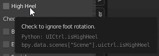
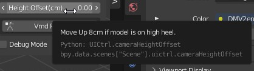
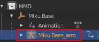
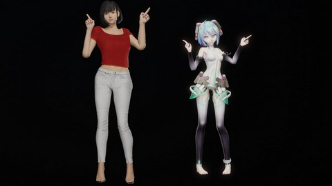
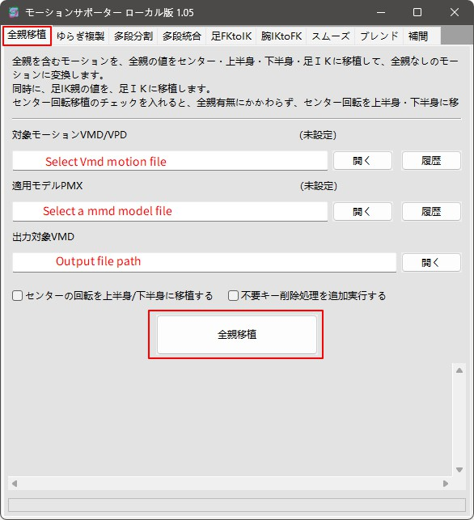

#### 本扩展现在运行良好，几乎处理所有vmd动作都没有问题。因此，如果你导入有问题，请先对着本文最后的"[常见问题](#常见问题)"部分，一项项排查看哪里没有弄对。   

# Blender扩展: Vmd Retargeting
本扩展能够导入mmd的vmd数据到Daz或CC模型而无须mmd模型，或通过mmd模型转换动作。  

 
  

中文界面  
  

# 演示视频
[https://youtu.be/Xgfu8oSjUUs](https://youtu.be/Xgfu8oSjUUs)  
  
b站：  
[https://www.bilibili.com/video/BV1Qb4y147Q3/](https://www.bilibili.com/video/BV1Qb4y147Q3/)  

# 教程视频
## 本扩展教程
[https://youtu.be/li7yjJKbbgI](https://youtu.be/li7yjJKbbgI)  
b站：  
[https://www.bilibili.com/video/BV1eu411q7qp/](https://www.bilibili.com/video/BV1eu411q7qp/)  

## Blender教程
Blender中设置Daz头发和衣服的物理: [https://youtu.be/1RzwmTgcfys](https://youtu.be/1RzwmTgcfys)  
b站：[https://www.bilibili.com/video/BV1Yi4y1m77r](https://www.bilibili.com/video/BV1Yi4y1m77r)  
  
  
导出MMD动作到Daz Studio: [https://youtu.be/FEA9hVouKFg](https://youtu.be/FEA9hVouKFg)  
b站: [https://www.bilibili.com/video/BV1dg411h7Ri/](https://www.bilibili.com/video/BV1dg411h7Ri/)  

[DazStudio导入mmd动作的设置](#DazStudio导入mmd动作的设置)[视频教程中未提到]  

# 赠品
## Daz人模一键转为MMD人模
参见专门的使用说明：[Daz to MMD](daz_to_mmd.cn.md)   

## 为实时模拟物理创建代理
参见章节： [为实时模拟物理布料创建代理模型](#为实时模拟物理布料创建代理模型)

# 基本信息
### 下载
爱发电下载(推荐)：  
[https://afdian.net/item/44e30d86d2c311ed9a2c5254001e7c00](https://afdian.net/item/44e30d86d2c311ed9a2c5254001e7c00)  
购买后会有站内信，内有网盘下载地址。  

Blender市场(推荐)：  
[https://blendermarket.com/products/vmd-retargeting](https://blendermarket.com/products/vmd-retargeting)  
Blender市场购买、下载、更新、反馈，都是最方便的，推荐。  

微博专栏下载(废弃，不建议使用)：  
[微博专栏](https://m.weibo.cn/c/wbox?id=wqh75bb2ni&appName=%E6%96%87%E7%AB%A0%E4%B8%93%E6%A0%8F&appIcon=&topNavMode=0&cid=7618111255681025&click_from=share)  
需要微博手机APP，购买付费专栏后，里面有一篇文章叫下载篇，内含网盘下载地址。   

(如果爱发电没有问题，微博专栏购买渠道将在一个月之后撤下。已经购买的用户不受影响)  

### Github
**github项目池用于交流反馈和多语言翻译，不含有扩展代码**  
[https://github.com/butaixianran/Blender-Vmd-Retargeting](https://github.com/butaixianran/Blender-Vmd-Retargeting)  

### 版本
扩展版本：1.25.0     
Blender版本：3.0或以上  

# 功能
* 导入vmd文件，无须mmd模型
* 或，从已经导入的mmd模型上转换动作数据
* 
* 分别导入身体、眼球、表情、口型或摄影机数据
* 当Daz/CC模型有高跟鞋时，修正脚踝旋转
* 设置补间曲线和平滑出入
* 设置手臂旋转比例，以解决手臂穿入身体的问题  
* 设置相机偏移和旋转比例，以解决模型尺寸差异
* 
* (**赠品**)[Daz人模转为MMD人模](daz_to_mmd.cn.md)   

# 安装
* 打开blender，安装你获得的.zip文件
* 在扩展列表中，搜索 "Vmd retargeting" 进行启用
* 在工作区域，按下N，显示侧边栏工具面板。在里面选择"Vmd Retarget"面板即可  

如果你不知道怎么给blender安装扩展，请网络搜索："blender 安装扩展"了解详情。

# 使用方法
## 准备模型
本扩展支持以下人模:
* Daz Genesis 8，由 [Diffeomorphic daz importer](https://diffeomorphic.blogspot.com/) 导入
* Daz Genesis 8，由 [Daz to Blender桥接插件Blender 3.x 更新版](https://github.com/butaixianran/DazToBlender)导入  
* Daz Genesis 8, 由 [Daz to Blender官方桥接插件2022](https://www.daz3d.com/forums/discussion/572806/official-daztoblender-bridge-2022-what-s-new-and-how-to-use-it)导入
* CC4(Character Creator) 人模，由 [cc blender tools addon](https://github.com/soupday/cc_blender_tools) 导入  

  

通过fbx文件导入的人模，cc也没问题。但daz的，本扩展将无法转换表情。  

### 关于Blender 5.x
请使用5.0.0以上版本的Diffeomorphic import_daz
[https://bitbucket.org/Diffeomorphic/import_daz/wiki/Home](https://bitbucket.org/Diffeomorphic/import_daz/wiki/Home)   

  

如果目录名字类似"Diffeomorphic-import_daz-xxxxxxxxxx"，解压下载的文件，重命名这个文件夹为"import_daz"，打包成新的zip文件。然后把这个新的zip文件，作为Blenderk扩展安装。
  

### 准备CC4模型
请直接从Character Creator导出人模，而不是iClone。请只导出Mesh，不带动画。  

使用扩展 [cc_blender_tools](https://github.com/soupday/cc_blender_tools) 导入模型到Blender。  

导入之前，在扩展面板的"Import"选项中，**取消勾选** 眼球、下巴、头部的Shapekey Driver。    
 

从CC导出时，请选择A-Pose。  
  
导入Blender后姿势需要如下图：  
  

### 准备Daz模型（使用Diffeomorphic Daz Importer）
[Diffeomorphic import_daz](https://bitbucket.org/Diffeomorphic/import_daz/wiki/Home)强大而复杂。但这里只需要点击几个按钮即可。  

首先，你需要了解它基本使用方法，如何在Daz Studio准备一个模型用于导出给Diffeomorphic import_daz用。**中文入门教程**参见：  
[diffeomorphic_daz_import_setup_tutorial.cn.md](diffeomorphic_daz_import_setup_tutorial.cn.md)   

接着，进入Diff import_daz 扩展的全局设置(Global Setting)。在中间"Rigging"区域，有4个勾选框：  
"Location Locks, Location Limits, Rotation Locks, Rotation Limits"  
确保这几个**没有勾选**。  
  

然后，当要导入模型到blender时，你需要3个东西:
* 合并所有骨架到人模身体骨架
* 面部表情的Morph变形
* 让所有骨骼可以调整（Make all bone poseable）  

**最简单的实现方法是，点击："Easy Import Daz"按钮**   
它已经帮你勾选了"**Merge Rigs**"和"**Make All Bones Poseable**"。如果没有，就自己勾上。  

#### 对于Genesis 8
* 对于Diffeomorphic import_daz 5.0版本：
勾选："**Face Units**" 和 "**Visemes**"，点击导入。  

* 对于Diffeomorphic import_daz 5.0之后的最新开发版本
勾选："**Head**"，点击导入。  

#### 对于Genesis 9
勾选："**FACS**"，点击导入。  

**注意：Genesis 9改变了 扭曲骨骼的结构，扭曲骨骼现在不在手臂中。使得MMD的扭曲骨骼，无法映射到手臂中。所以，任何使用了扭曲骨骼的mmd动作，都将无法转换到Genesis 9。你可以尝试使用一个MMD人模作为动作源的方式转换。但不保证效果。**  

### 准备Daz模型（使用Daz to Blender桥接插件Blender，以下简称DFB）
这个功能，是给非常熟悉Daz和Blender，且能够自学DFB的用户使用的。强烈建议对Daz和Blender不够熟悉的用户，选择Diffeomorphic import_daz。

这个版本的DFB，不是Daz官方的DTB 2022。而是本人基于官方版本，继续修改的版本，修复了官方的大量bug，添加很多方便的功能和选项。只支持Blender 3.x-4.x，不支持Blender 5
[https://github.com/butaixianran/DazToBlender](https://github.com/butaixianran/DazToBlender)  

这个DFB版本的最大好处是，morph就在身体模型的shape key上且没有driver。而且，材质也是标准Principled材质。  

因此，Daz模型导入mmd的动作后，可以连同动作和材质一起，从Blender导出到任何其他3D软件。包括游戏引擎。  

**在安装DTB之后:**   
* Daz中，导出人模时，勾选"**Include Morphs**"来导出morph
* 进入"**choose morphs**"，点击左下角**Genesis 8 Facial Morphs** 和 **Visemes**按钮，把这些morph添加到输出列表。
* 输出人模
* 在Blender中，在DFB扩展面板上，点击导入，完成。

### 准备Daz模型（使用官方Daz to Blender 2022，以下简称DTB 2022）
官方重新开发的DTB已经发布了，但是包含了所有当年的老旧问题和bug，都没有修复。所以不推荐这个官方插件。   

这个DTB，和几年前的老版本相比，只是重写了Daz端，把脚本语言，换成了C++。Blender一侧，没有什么改动。大量问题隐藏其中，可能永远都不会修复。顺便一提，那个写出了超多bug老版本的人，去了EA。  

目前，这个新的官方版本，唯一的好处是安装特别简单。但是其他方面，远不如Diffeomorphic import_daz。    

你需要在这个帖子中了解如何安装和使用它:  
[https://www.daz3d.com/forums/discussion/572806/official-daztoblender-bridge-2022-what-s-new-and-how-to-use-it](https://www.daz3d.com/forums/discussion/572806/official-daztoblender-bridge-2022-what-s-new-and-how-to-use-it)  

**安装DTB之后:**   
* 在Daz中, 导出人模时, 勾选 "**Export Morphs**"
* 打开 "**choose morphs**" 对话框, 从左侧 "Pose Controls" 分类下, 添加 **Eyes**, **Mouth**, **Brow**  和 **Visemes** 表情到"**Morphs to Export**" 列表。  
* 点击导出  
* 在Blender中, 在DTB扩展面板, 点击导入, 完成  

## 准备一个vmd文件
无须额外操作。  

万一碰到某个vmd文件导入后，人物像跳机器舞一样，从一个动作跳到另一个动作。说明这个vmd文件，没有遵守vmd文件格式规范。要么是非常老旧的vmd文件，要么是第三方软件生成的vmd文件。

对于这种罕见情况，只需在MMD中，读取一个**TDA模型**，加载这个vmd动作，再另存为一个新vmd文件。这个新vmd文件，将变成规范的vmd格式，本扩展即可读取。

## 导入vmd动作
相当简单：
* 选择人模骨架
* 选择vmd文件
* 选择人模类型
* 勾选要导入的部分
* 如果这个动作没有使用IK，就去掉勾选IK
* 点击 "执行", 完成.

每个部分，都会导入为一个action，并包装为一个strip，放到一条新轨道上。可在NLA(Nonlinear Animation)中查看  

这样，这些动作就不会弄乱你的时间线，你还可以像剪辑块一样，整体移动或删除他们。  

## 选项
移动鼠标到面板的各个控件上，会显示一个有用的提示。比如：  

高跟鞋的提示：  
  

摄像机偏移的提示：  
  

### 高跟鞋
勾选后将无视vmd的脚踝旋转。  

### 身体动作
#### 轨道
身体动作被分开放在多条轨道上。  

原因比如，mmd不支持分层运动。因此，会用多个效果相同的骨骼，来模拟分层运动。对于这种情况，我们是把对应骨骼的运动，放到一个真正的新轨道上。

目前，我们仅处理：center骨骼和groove骨骼  

#### 手臂旋转比例
Daz/CC人模的手长和mmd人模不同。因此，如果mmd人模将手放到胸口，在Daz/CC人模，手必然就会穿入身体。  

把上下手臂旋转比例都设为0.8一般能够解决这个问题。  

但是如果你使用CC模型，一般设置为1.0更好  

### 手臂旋转欧拉角增量
只支持前臂。用户可以自己调节要添加或减少的角度值，从而避免前臂穿模。 和手臂旋转比例一起用，能基本解决穿模问题。  

默认值：  
>上臂旋转比例：0.9   
>前臂旋转比例: 1.0   
>左前臂：-5, 0, 3   
>右前臂：-5, 0, -3   

如果默认值穿模，尝试下面的数值：
>上臂旋转比例：1.0   
>前臂旋转比例: 1.0   
>左前臂：0, 0, 0   
>右前臂：0, 0, 0   

或者：  
>上臂旋转比例：0.8   
>前臂旋转比例：0.8   
>左前臂：-15, 0, 9   
>右前臂：-15, 0, -9   

#### 选择一个mmd模型作为数据源
如果你选择了一个mmd模型作为数据源，本扩展在导入身体运动时，就会忽视你选择的vmd文件，而从你指定的mmd模型上转换身体运动。  

眼球和表情口型，还是会从你选择的vmd文件读取。  

你需要blender mmd tools来导入一个mmd模型到blender：  
[https://github.com/UuuNyaa/blender_mmd_tools](https://github.com/UuuNyaa/blender_mmd_tools)  

**导入mmd模型时，取消勾选骨骼重命名！** 我们使用日文骨骼名称来映射骨骼。    
  

**然后，用mmd tools导入vmd动作到你的mmd模型，而不是用本扩展。** 方法如下：  
* 选中mmd模型，前往`文件菜单->import->vmd file`选择一个vmd文件。  
* 现在，mmd模型上，应该有了动作数据。  
* 然后，选择你的daz或cc模型，在本扩展的"Source"(源)部分，使用吸管选择器，选择这个mmd模型的骨架作为源。
* **注意，不要选择它的空父亲对象**    
  

最后，确保当前选择的骨架是Daz或CC模型，点击"执行"。  

这样就会转换映射过的骨骼上的每一帧，而不只是关键帧，所以速度会非常慢。  

这种方式，扩展不会给Daz/CC添加Ik骨骼。  

注意，这种方式下，扩展面板的选项 手臂旋转比例和手臂欧拉角增加量 将不起作用。  

**我们为此制作了一个单独的视频教程：**  
[https://youtu.be/rttA3v_5S2I](https://youtu.be/rttA3v_5S2I)  
  
b站：   
[https://www.bilibili.com/video/BV12T4y1Q777](https://www.bilibili.com/video/BV12T4y1Q777)  

### 补间曲线和平滑
你可以从这里找到示例图： [https://easings.net/](https://easings.net/)  

  

这个设置不会影响摄像机。摄像机运动永远是线性的。  

默认选项下，本扩展会把vmd的每个关键帧曲线，转换为最接近的Blender内置关键帧曲线。大部分情况都有合理的效果。

如果你希望Daz/CC人模上的动作，和mmd模型上完全一样流畅，你有2个选择:  
* 在本扩展上，选择一个mmd人模作为数据源。这样，就会转换每一帧，而不只是关键帧。
* 或者，你可以下载 [MikuMikuMoving](https://sites.google.com/site/mikumikumovingeng/)。加载一个mmd人模和vmd动作到MikuMikuMoving，然后导出为新的vmd动作。导出的时候，勾选上"**Integrate layer**"。这样，就会导出每一帧，而不仅仅是关键帧。然后，把这个新的vmd文件，用于本扩展。**(只把新vmd文件用于身体动作。表情口型还是用原始vmd文件)**  

### 摄像机位置比例和高度偏移
Daz/CC人模和mmd模型的尺寸不同。因此，摄像机需要调整   

默认值大部分时候工作的很好。  
但如果你的CC人模穿了高跟鞋，你可能需要往上移动摄像机高度8厘米。  

当然，你也可以直接使用 Blender mmd tools导入一个vmd摄影机动画。

# 局限性
## 全親骨
mmd模型上，有个叫"全ての親"的骨骼。任何vmd动作，都不应该使用这个骨骼。它是用于给最终用户，加载动作之后，移动模型位置用的。在Blender中，相当于移动整个物体，而不是某个骨骼。  

由于任何vmd动作都不应该用这个骨骼，所以本扩展没有处理它。  

但是，有少量vmd动作作者，无视了这个规则。他们把全亲骨骼，直接当作身体骨骼用。在mmd世界中，这就成了一个问题。

所以，在mmd世界中，有个免费工具，用于把全亲骨骼的运动，转换到身体骨骼上。这个工具叫"Motion Supporter"。如果你的vmd动作，使用了全亲骨，你就需要用这个工具，进行转换，再把转换后的动作，用于本扩展。  

**MotionSupporter使用教程**  
* 下载: [https://bowlroll.net/file/233713](https://bowlroll.net/file/233713)  
* 解压运行, 选择 "**全親移植**" 页面:  
  

* 第1行, 选择或拖拽vmd动作文件.  
* 第2行, 选择或拖拽mmd模型文件.  

>**如果TDA模型转换效果不好，就使用YYB Miku模型。这个工具的开发者，是用YYB Miku模型进行测试的。**   
>
>下载YYB Miku模型：[https://bowlroll.net/file/284016](https://bowlroll.net/file/284016)  

* 第3行, 转换后的vmd动作文件保存位置。

* 第4行, **不要勾选任何选项**.    

* 点击最下方的大按钮，进行转换。
* 转换之后，把生成的vmd动作文件，用于VMD Retargeting扩展即可。  

## 肩膀旋转
mmd模型有3个肩膀骨骼：肩, 肩P, 肩C。本扩展无视了肩P和肩C。  

## 扭曲骨骼(Twist Bone)
mmd模型也带有扭曲骨骼，只有很少的vmd动作会使用。对于Daz G8/8.1人模，这种骨骼可以比较好的转换。但对于CC和Daz G9人模，由于扭曲骨骼机制完全不一样，难以转换。  

因此，如果你使用的vmd动作，使用了扭曲骨骼，那么你最好使用Daz G8/8.1模型。  

目前为止，我知道的仅有的2个使用扭曲骨骼的作者是：Natsumi San 和 Fairy Tale。  

## 腰部骨骼
Mmd的腰部骨骼，是上半身和下半身的父亲，因此可以当作hip骨骼，旋转全身。  

没有其他任何人模，会这样设计腰部骨骼。因此，我们把腰部骨骼的数据，转换到上半身的脊椎骨骼。  

几乎没有任何vmd动作使用腰部骨骼，所以这个转换不会成为问题。  

但是，Natsumi San的少量动作数据，可能用到腰部骨骼。不过，只要这个动作不把腰部骨骼当作hip来旋转全身，我们的转换就不会有问题。  

## 道具运动
本扩展不会处理。  

# 为实时模拟物理布料创建代理模型
## 视频教程
Youtube:  
[https://youtu.be/lGAWgWxJjFc](https://youtu.be/lGAWgWxJjFc)  

Bilibili:  
[https://www.bilibili.com/video/BV1uV411Q73a/](https://www.bilibili.com/video/BV1uV411Q73a/)  

## 创建代理模型
在本扩展的"Tool"面板上，有2个新按钮：**创建和清除代理模型**。这些可以用于快速计算物理。  

Daz或CC人模以及衣服，拥有太多面数。所以，衣服物理的计算非常非常慢。  

要提高速度，通常，你需要手动做以下事情：  
* 复制身体和衣服模型
* 对复制的模型进行减面

然后，添加布料和碰撞效果，到这些减面的模型上。这样再计算物理，就会快得多。  

这些为了计算物理而减面的复制模型，就是代理模型。   

现在，使用本扩展，选择一个模型，点击"**创建代理模型**" 按钮，就能一键创建一个经过减面的复制模型作为代理。  

这样，你只需要往这个复制模型上添加布料或碰撞效果，就能有快得多的物理效果。

以下是完整步骤：  

**对于人模:**  
* 选择人模的身体模型（不是骨架）
* 本扩展上，点击 "**创建代理模型**" 按钮
* 前往blender的物理面板, 给这个代理模型添加 "**Collision**" 碰撞效果。  
* 在碰撞设置中，修改 "**thickness outer**"(外部厚度) 为 0.002
* 隐藏这个代理模型，显示原始人模(预览窗口和渲染都是)
* 完成

**对于需要物理的服装:**  
* 先如上设置好人模的碰撞
* 选择服装模型
* 确认这个服装模型上，有用于固定(pin)部位的顶点集。  
如果你是使用Daz的dforce服装，使用Diff daz importer导入，那么这个衣服上会自带一个叫"**dForce Pin**"的顶点集。这样你就不用自己再去创建了。  

* 扩展面板上，Tool面板，点击"**创建代理模型**" 按钮
* 前往blender的物理面板，给生成的代理模型，添加"**Cloth**"布料效果  
* 在布料设置中， "**Shape**" 部分, "**Pin Group**" 选项上，选择你用于固定部位的顶点集。对于Daz的dforce衣服，就是"**dForce Pin**"
* 修改 Cache部分的 "**Simulation end**"（结束帧）为你的项目的结束帧
* 点击Bake烘培服装物理。

## 清除代理模型
点击扩展面板Tool面板上的这个按钮，将清除所有已经创建的代理模型

## 手臂穿过衣服
物理计算时一个常见问题是，手臂穿过裙子，并把裙子拽离，导致裙子破损。

如果没有代理模型，这个问题是无解的。但是，有了本扩展创建的代理模型，你只需要在代理人模上，把双手的顶点删除，然后隐藏代理，显示原始模型即可。这样，物理计算使用没有手臂的代理，而渲染使用有手臂的原始模型。  

完整步骤：
* 隐藏原始人模，显示并选择代理人模
* 前往编辑模式
* 点击空白区域，取消选择顶点
* 开启视图窗口的X射线模式
* 选择左右手臂的顶点
* 按下 "x"，弹出菜单中，选择 "**vertices**" 来删除双臂的所有顶点
* 结束编辑，回到对象模式
* 关闭视图窗口的X射线模式
* 隐藏这个代理模型，显示原始模型

现在，你可以Bake衣服的物理了。  

# 常见问题
我们为一些常见问题制作了教程视频:  
[https://youtu.be/qBivoDgFpc4](https://youtu.be/qBivoDgFpc4)    
b站：  [https://www.bilibili.com/video/BV1y14y187Ck/](https://www.bilibili.com/video/BV1y14y187Ck/)  

## Daz衣服头发不随身体
导入人模的时候，使用Easy Import Daz，并勾选"Merge Rigs"(合并骨架)。视频教程和文档都有强调。  

## Daz没有表情
导入人模的时候，使用Easy Import Daz，G8勾选"Face Units" 和 "Visemes"; G9勾选"FACS"。视频教程和文档都有强调。  

## Daz Genesis 9
你需要安装diff daz importer **1.6.2以上版本**，才能导入Genesis 9。   

如果你的Blender中已经安装了1.6.1版本，你必须先删除1.6.1版本，重新打开Blender，再安装1.6.2版本。安装之后，你要重新设置Global Setting中的所有选项。新版本中，很多文件和设置都发生了变化。   

**注意：Genesis 9改变了扭曲骨骼的结构，扭曲骨骼不在手臂中。使得MMD的扭曲骨骼，无法映射到手臂中。所以，任何使用了扭曲骨骼的mmd动作，都将无法转换到Genesis 9。**  

## 动作导入后脚不弯曲
原因是，该动作没有使用IK。

#### 解决方法1
导入前，扩展面板上，IK设为关闭即可。  

去掉IK后，如果脚下有滑步现象，请在扩展面板，把x轴位移比例设为0.5再导入。  

#### 解决方法2
另一个根治方法是，用第三方工具：**mmd MotionSupporter(只有日语版)** 把FK 转换为 IK。好处是，转换后，几乎没有滑步。缺点是，转换一个vmd动作需要约5分钟。  

**MotionSupporter使用方法如下：**  
* 下载：[https://bowlroll.net/file/233713](https://bowlroll.net/file/233713)  
* 解压后运行，选择 "**足FKtoIK**" 分页，如下图  
  

* 第一行，选择或拖入vmd文件
* 第二行，选择或拖入mmd模型。将根据这个模型的腿长，计算IK位置。  

>这里，推荐使用 YYB式 初音，而不是TDA人模。TDA人模转换后，腿部容易出现抖动。而该软件原作者，是使用YYB式初音演示该功能。因此，推荐YYB式初音。  
>
>YYB式初音下载：[https://bowlroll.net/file/284016](https://bowlroll.net/file/284016)  

* 第三行，转换后的新vmd文件保存位置。默认保存在原vmd文件同目录下。一般不用改。

* 第四行，**请按图中进行勾选**。错一个，转换后腿部就会抖动。

>尤其是，"足IKブレ固定"必须设为0。它是设置一个距离范围，这个距离范围内的腿部运动，都当作腿没动。因此，只要大于0，转换就会丢帧，腿就会抖动。

* 点击最下方按钮，开始转换。
* 转换完成后，这个新的vmd文件，就有了IK，就消除了滑步。
* 本扩展中，直接导入这个新vmd文件即可。

## 动作导入后手臂旋转不一致
如果只有手臂不一致，请把手臂旋转比例改为1.0看看效果。默认是0.9，是为了防止穿模。  

如果是CC人模，手臂旋转比例直接使用1.0即可。  

## 动作导入后，人物不会转身，部分动作不正常
* Diff Daz Importer扩展面板上，"**Global Setting**"中，**Rigging** 部分，是否勾选了很多选项？如果是，请去掉勾选这些选项，他们是限制人物动作幅度的。人物被限制了，当然就无法大幅运动，甚至抽搐。  
  

## 动作导入后整体不正常
目前本扩展运行稳定，在各种vmd动作中测试效果良好。因此请按照如下项目检查，看是哪个地方和教程不一致。  

* 如果是CC人模，是否从CC导出，而不是从iClone导出？是否选择A-Pose？
* 如果是CC人模，扩展上人模类型，是否切换到CC3或CC4？
* 如果是DTB导入的Daz人模，扩展上人模类型，是否切换到DTB？
* 是否使用Blender 3.0以上版本？
* 是否使用本扩展最新版本？
* 是否使用G8人模？
* Daz中，每次导出人模时，是否有使用"**Export to Bender**"导出"`.dbz`"文件
* Daz中，使用"**Export to Bender**"时，是否错误的选择了"**HD**"菜单？
* Blender中，diffeomorphic daz importer的全局设置中，是否有用左下角"**Load Root Path**"按钮设置好Daz库的路径。Daz有多个库时尤其需要检查此项。
* 该vmd动作是否有使用IK？如果没有，导入前，请在扩展面板上关闭IK
* Blender右侧，Scene面板中，Unit单位设置里，Scale是否为1？
* 测试不同vmd作者的其他动作，是否正常？

如果测试不同vmd作者的动作正常，只有这一个vmd作者的动作有问题，那么请通过github，b站，微博或blendermarket联系我们，告诉我们这个vmd动作的名字，我们来检查原因。  

## shift_jis报错
报错信息中，包含`shift_jis`这样的内容。这是只有极少数中文vmd动作特有的错误。  

这个报错的意思是，这个vmd文件，不符合vmd格式标准，没有使用日文编码。说明这个vmd文件，不是mmd里制作的，而是用其他工具生成的。那么，只需要打开mmd，加载一个TDA模型，加载这个vmd文件，然后另存为一个新的vmd文件，这个新的vmd文件，就会自动变成日文编码，就不会报错了。  

## 眼睛不能完全闭合
眼睛的闭合不正确的情况是因为：mmd有很多个表情选项，都是调节眼睛闭合。而其他人模，都只有1个选项调节眼睛闭合。  

一般，vmd动作作者，知道这一点，所以只会使用多个眼睛闭合中的1个，进行调节，就不会乱套或冲突。但有很少数vmd动作作者，会像好玩一样，每个闭合选项都调节一点。  

因为mmd的多个眼睛闭合，都对应到daz人模的同一个眼睛闭合，于是数据会不断相互覆盖，而不是叠加，导致转换后眼睛不闭合。  

这个问题非常少见，但万一碰到，唯一的解决办法，是去mmd里，把多个眼睛闭合数据中的其他几个清理掉，只留下一个。  

mmd的几个眼睛闭合表情是：ウィンク, ウィンク２, まばたき, 笑い, なごみ   

## DazStudio导入mmd动作的设置
关于把mmd动作导入Daz Studio，我们创建了一个视频教程  
[https://youtu.be/FEA9hVouKFg](https://youtu.be/FEA9hVouKFg)  

但是，有个Daz Studio的关键设置，视频中没有提到。  

在Daz Studio中, Genesis 8上，每个骨骼都有**隐藏并上锁**的x, y, z旋转轴属性。如下图。  
  

从Blender导出的daz动作预设，需要用到这些隐藏属性。所以，Daz中，你需要在每个骨骼上，**显示并解锁这些x,y,z旋转属性**，然后再导入动作预设。如下图。  
  

要显示这些属性，前往参数面板的选项菜单->"Preferences"->"Show Hidden Properties", 勾选。如下图。  

然后，对每个骨骼**解锁x, y, z旋转属性**。只解锁旋转。如下图。  
  

这是Daz G3, G8的持续多年的恶心设计，只要导入外部数据，就要解锁这些隐藏属性。给每个Daz人物都这么全部解锁一遍就太要命了。所以，已经有人写了Daz脚本来自动做这件事。  

下载下面的Daz脚本:  
[https://www.dropbox.com/s/pjojvrnymcdi388/](https://www.dropbox.com/s/pjojvrnymcdi388/)  

在Daz中，选择你的G8人模，然后双击运行这个脚本即可解锁。之后就能导入动作了。  

如果某一天，这个脚本地址失效，你可以去下面原本的脚本发布视频，获取新地址：  
[https://www.youtube.com/watch?v=wHiKCx8nj5k](https://www.youtube.com/watch?v=wHiKCx8nj5k)  

  

# 更新Log:
## 1.25.0
* 尝试支持Blender 5
* 隐藏"清除动画"按钮。因为在Blender 5下还存在问题。

## 1.24.2
* 在使用 MMD人模作为动作源的时候，关闭Daz/CC人模上的IK

## 1.24.1
* 在把Daz人模转换为MMD人模时，修正头部骨骼映射关系

## 1.24.0
* 重要新功能：创建清除代理模型

## 1.23.0
* 添加"清除动画"按钮

## 1.22.0
* 重新映射 "腰"骨骼，类似center和groove骨骼，作为hip骨骼的一个层。当直接导入vmd文件时，腰骨骼的运动将添加到单独的NLA轨道作为一层。

## 1.21.0
* 更新使用MMD模型作为数据源时，上半身的计算方式，用世界空间，而不是本地空间计算。这样，就能更好的处理MMD的分层骨骼，比如 肩P或扭曲骨骼。代价是，手臂旋转比例和旋转角度增量，在这个模式下将不起作用。  

## 1.20.2
* 在vmd文件没有使用IK的时候，忽略IK骨骼

## 1.20.0
* 添加IK親骨骼和脚踝IK骨骼，以实现完整的mmd风格IK系统。如果碰到脚踝旋转有问题的情况，请勾选"高跟鞋"，就会回到之前的IK处理方式。  

## 1.19.1
* 为cc3人模的膝盖增加一点弯曲，不然ik不能完全起作用

## 1.19.0
* 支持Genesis 9(仅diff daz importer)

## 1.18.3
* 修正手掌默认姿势，手掌现在也不穿模了
* 添加 "重用已经生成的贴图" 选项到"Daz to MMD"功能

## 1.18.2
* 为DTB 2022导入的人模移除大腿IK限制
* 当鞋子模型是左右脚分开的两个模型时，修复"Daz to MMD"的脚趾问题

## 1.18.0
* 修改算法，使用当前Pose为Rest Pose，以彻底解决手臂穿模问题。现在的算法和blender mmd tools完全一样。
* 允许IK骨骼和大腿旋转共用，以在没有IK Pole骨骼的情况下，控制膝盖方向。这一点也和blender mmd tools做法相同。
* 添加检查新版本按钮，点击后，如果有新版本会提示。
* 添加Rig功能区，其中添加 Daz to MMD功能，用于把Daz人模一键转换为MMD人模。

## 1.14.1
* 为DTB 2022导入的人模，设置小腿骨骼的IK僵直为0

## 1.14.0
* 使用旋转限制代替IK Pole Bone
* 更改Daz模型手臂的默认姿势差异，从10度改为8度。

## 1.13.0
* 新增设置前臂旋转欧拉角增量的选项
* 修正从vmd文件读取IK开关状态时的一个bug

## 1.12.0
* 支持读取vmd文件的补间曲线（仅骨骼旋转）

## 1.11.0
* 添加自动判断是否需要使用IK的选项

## 1.10.0
* 添加文档和反馈页面按钮

## 1.9.0
* 支持 IK親 骨骼。现在 Fairy Tale 的vmd动作可以正常使用了。比如，AOA的"like a cat"。

## 1.8.0
* 支持新的Daz to Blender Bridge 2022，详情查看文档.

## 1.7.2
* 添加"Object you selected is not an Armature"的中文翻译。

## 1.7.1
* 检查Blender版本。禁止Blender 3.0以下版本使用本扩展

## 1.7.0
* 支持CC4

## 1.6.4
* 美化UI
* 运行时进入Object模式，以防止用户在其他模式运行导致报错
* 去掉调试模式按钮，添加显示扩展版本

## 1.6.3
* 设置 "ぺろっ" 和 "口角上げ"的转换比例为0.5，以让笑容更合理
* 处理"shift_jis"错误，显示一个错误提示
* 修正使用DTB人模时无法导入摄影机的问题

## 1.6.0
* 支持通过官方Daz to Blender桥接工具导入的Daz人模。需要基于Blender 3.x更新的版本：  
[https://github.com/butaixianran/DazToBlender](https://github.com/butaixianran/DazToBlender)  

## 1.5.0
* 增加对扭曲骨骼和腰部骨骼的转换

## 1.4.1
* 修正对Blender 3.1的支持
* 增加肩膀旋转比例

## 更早
* 手臂旋转比例默认为0.8。因为每个vmd动作都会把手往头和胸腔放，而导致穿模。
* 添加肩膀旋转比例，然后移除。感觉用处不大
* 添加IK的勾选框。去掉勾选就不会创建IK骨骼
* 处理Center骨骼的旋转
* 当从vmd文件导入数据时，移除腿部额外旋转，因为IK已经在控制腿部了
* 当从mmd模型转换数据时，修复脚踝旋转
* 手臂旋转比例现在对从mmd模型转换数据也可以使用了。
    - 重写了从mmd模型转换动作的方法，将其分为上半身和下半身两部分，用全新方式转换上半身，从而实现这个新特性。
* 当选择的模型不是Daz或CC3，却点击了执行时，进行提示