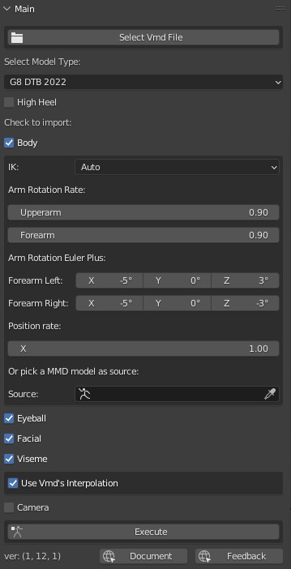
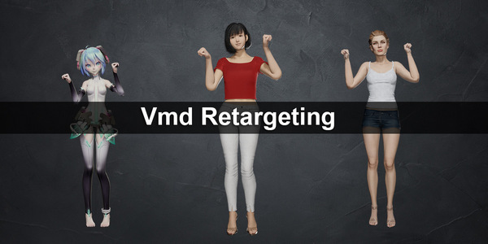
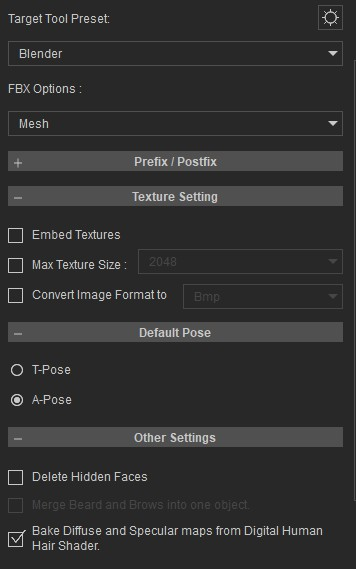
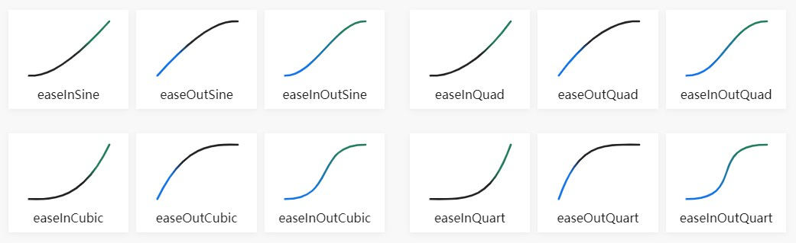

#### 注意：已经购买的用户请升级到最新版，修复了一些关键bug，并且支持Blender 3.1，并且处理了扭曲骨骼，以使用Natsumi San的动作数据  

# Blender扩展: Vmd Retargeting
本扩展能够导入mmd的vmd数据到Daz或CC3模型而无须mmd模型，或通过mmd模型转换动作。  

 
  

中文界面  
  

# 演示视频
[https://youtu.be/Xgfu8oSjUUs](https://youtu.be/Xgfu8oSjUUs)  
  
b站：  
[https://www.bilibili.com/video/BV1Qb4y147Q3/](https://www.bilibili.com/video/BV1Qb4y147Q3/)  

# 教程视频
[https://youtu.be/li7yjJKbbgI](https://youtu.be/li7yjJKbbgI)  
b站：  
[https://www.bilibili.com/video/BV1eu411q7qp/](https://www.bilibili.com/video/BV1eu411q7qp/)  

# 基本信息
### 下载
微博专栏下载：  
[https://weibo.com/a/hot/7618111255681025_1.html](https://weibo.com/a/hot/7618111255681025_1.html)  

Blender市场：  
[https://blendermarket.com/products/vmd-retargeting](https://blendermarket.com/products/vmd-retargeting)  

### Blender论坛
[https://blenderartists.org/t/addon-retarget-mmds-vmd-motion-to-daz-or-cc3/1361902](https://blenderartists.org/t/addon-retarget-mmds-vmd-motion-to-daz-or-cc3/1361902)

### Github
github项目池用于交流反馈和多语言翻译  
[https://github.com/butaixianran/Blender-Vmd-Retargeting](https://github.com/butaixianran/Blender-Vmd-Retargeting)

### 版本
扩展版本：1.6.3  
Blender版本：3.0或以上

# 功能
* 导入vmd文件，无须mmd模型
* 或，从已经导入的mmd模型上转换动作数据
* 
* 分别导入身体、眼球、表情、口型或摄影机数据
* 当Daz/CC3模型有高跟鞋时，修正脚踝旋转
* 设置补间曲线和平滑出入
* 设置手臂旋转比例，以解决手臂穿入身体的问题  
* 设置相机偏移和旋转比例，以解决模型尺寸差异

# 安装
* 打开blender，安装你获得的.zip文件
* 在扩展列表中，搜索 "Vmd retargeting" 进行启用
* 在工作区域，按下N，显示侧边栏工具面板。在里面选择"Vmd Retarget"面板即可  

如果你不知道怎么给blender安装扩展，请网络搜索："blender 安装扩展"了解详情。

# 使用方法
## 准备模型
本扩展支持以下人模:
* Daz Genesis 8，由 [Diffeomorphic daz importer](https://diffeomorphic.blogspot.com/) 导入
* Daz Genesis 8，由 [官方Daz to Blender桥接插件(blender 3.x 更新版本)](https://github.com/butaixianran/DazToBlender)导入  
* CC3(Character Creator) 人模，由 [cc3 blender tools addon](https://github.com/soupday/cc3_blender_tools) 导入  

通过fbx文件导入的人模，cc3应该也没问题。但daz的，本扩展将无法转换表情。  

如果你希望使用于通过fbx导入的Daz模型，请告诉我们原因。如果原因合理，我们就会添加对fbx的Daz的支持。  

### 准备CC3模型
无须准备。但请直接从Character Creator导出人模，而不是iClone。  

从CC导出时，请选择A-Pose。（CC3+才能选）  
  
导入Blender后姿势需要如下图：  
  

### 准备Daz模型（使用Diffeomorphic Daz Importer）
[Diffeomorphic daz importer](https://diffeomorphic.blogspot.com/)强大而复杂。但这里只需要点击几个按钮即可。  

首先，你需要了解它基本使用方法，如何在Daz Studio准备一个模型用于导出给Diffeomorphic daz importer用。**中文入门教程**参见：  
[diffeomorphic_daz_import_setup_tutorial.cn.md](diffeomorphic_daz_import_setup_tutorial.cn.md)  

然后，当要导入模型到blender时，你需要3个东西:
* 合并所有骨架到人模身体骨架
* Face Unit 和 Viseme 的Morph变形
* 让所有骨骼可以调整（Make all bone poseable）  

**最简单的实现方法是，点击："Easy Import Daz"按钮**  
默认，它已经帮你勾选了"Merge Rigs"。所以，你只需勾选："Face Units" 和 "Visemes"，然后点击导入即可。  

导入后，前往Diffeomorphic daz importer扩展的： "**Finish**" 部分，点击"**Make All Bones Poseable**"  
  
准备完毕。  

### 准备Daz模型（使用Daz官方Blender桥接插件，以下简称DTB）
这个功能，是给能够自学使用DTB的用户使用的。DTB的好处是，morph就在身体模型的shape key上且没有driver。而且，材质也是标准Principled材质。  

因此，Daz模型导入mmd的动作后，可以连同动作和材质一起，从Blender导出到任何其他3D软件。包括游戏引擎。  

如果你不知道如何使用DTB，需要自行阅读它的文档的安装部分（英文）：  
[https://github.com/butaixianran/DazToBlender](https://github.com/butaixianran/DazToBlender)  

并且浏览官方视频教程（英文）:  
[https://www.daz3d.com/daz-to-blender-bridge](https://www.daz3d.com/daz-to-blender-bridge)  

建议对Daz和Blender不够熟悉的用户选择Diffeomorphic Daz Importer。  

**在安装DTB之后:**   
* Daz中，导出人模时，勾选"**Include Morphs**"来导出morph
* 进入"**choose morphs**"，点击左下角**Genesis 8 Facial Morphs** 和 **Visemes**按钮，把这些morph添加到输出列表。
* 输出人模
* 在Blender中，在DTB扩展面板上，点击导入，完成。

## 准备一个vmd文件
一般来说，无须额外操作。  

但是，有少数老旧或特殊vmd文件，不使用通常的TDA骨骼名字或文件结构。  

如果直接导入这种vmd文件到Daz或CC3人模，会出现像机器舞一样，从一个姿势跳到另一个姿势的现象。  

对于这种vmd文件，只需要打开MikuMikuDance，加载一个TDA模型，加载这个动作，然后导出为新的vmd文件。  

这个新的vmd文件，将能够正常使用。

## 导入vmd动作
相当简单：
* 选择人模骨架
* 选择vmd文件
* 选择人模类型 (G8 by Differ Daz Importer, G8 by Official Daz Bridge or CC3)
* 勾选要导入的部分
* 确保你当前选择的模型是Daz或CC3，点击 "Execute", 完成.

每个部分，都会导入为一个action，并包装为一个strip，放到一条新轨道上。可在NLA(Nonlinear Animation)中查看  

这样，这些动作就不会弄乱你的时间线，你还可以像剪辑块一样，整体移动或删除他们。  

## 选项
移动鼠标到面板的各个控件上，会显示一个有用的提示。比如：  

高跟鞋的提示：  
  

摄像机偏移的提示：  
  

### 高跟鞋
勾选后将无视vmd的脚踝旋转。  

### 身体动作
#### 轨道
身体动作被分开放在多条轨道上。  

原因比如，mmd不支持分层运动。因此，会用多个效果相同的骨骼，来模拟分层运动。对于这种情况，我们是把对应骨骼的运动，放到一个真正的新轨道上。

目前，我们仅处理：center骨骼和groove骨骼  

#### IK
**如果某个vmd动作不使用IK，去掉勾选即可**  
如果一个动作不使用IK，而你在导入时勾选了IK，那么，因为IK上没有数据，脚就不会动。因此，你导入时也需要去掉勾选IK。  

去掉勾选IK后，会出现一个"位置比例X"的选项，设为0.5可以缓解无IK时，脚下有点滑步的问题。  

**IK大部分时候工作良好，但当腿部旋转特别大时，你需要了解以下信息：**  

CC3和Daz模型默认没有IK。因此本扩展在从vmd文件导入身体运动时，会创建IK  

但是，Daz/CC3人模有个问题：膝盖的默认姿势下完全没有弯曲。于是，就需要有个IK Pole骨骼，来告诉膝盖弯曲时，该指向哪个方向。  

因此，Daz/CC3的膝盖，会一直指向它们前面的IK Pole骨骼。而IK Pole骨骼会跟随盆骨旋转。  

这个机制在大部分时候工作良好。但是，如果腿部旋转过大，那么，只是跟随盆骨的IK Pole骨骼就不太行了。    

这种情况下，你需要从一个mmd模型上转换动作数据。因为mmd模型上已经计算过IK了，所以Daz/CC3人模可以直接获取腿部的最终旋转，而无须再创建IK。  

请参考"选择一个mmd模型作为数据源"的部分

#### 手臂旋转比例
Daz/CC3人模的手长和mmd人模不同。因此，如果mmd人模将手放到胸口，在Daz/CC3人模上手必然就会穿入身体。  

把上下手臂旋转比例都设为0.8一般能够解决这个问题。(现在这是默认设置)   

但是如果你使用CC3模型，一般设置为1.0更好   

#### 选择一个mmd模型作为数据源
如果你选择了一个mmd模型作为数据源，本扩展在导入身体运动时，就会忽视你选择的vmd文件，而从你指定的mmd模型上转换身体运动。  

眼球和表情口型，还是会从vmd文件读取。  

你需要blender mmd tools来导入一个mmd模型到blender：  
[https://github.com/UuuNyaa/blender_mmd_tools](https://github.com/UuuNyaa/blender_mmd_tools)  

**导入mmd模型时，取消勾选骨骼重命名！** 我们使用原日文骨骼名称来映射骨骼。    
  

**然后，用mmd tools导入vmd动作到你的mmd模型，而不是用本扩展。** 方法如下：  
* 选中mmd模型，前往`文件菜单->import->vmd file`选择一个vmd文件。  
* 现在，mmd模型上，应该有了动作数据。  
* 然后，选择你的daz或cc3模型，在本扩展的"Source"(源)部分，使用吸管选择器，选择这个mmd模型的骨架作为源。
* **注意，不要选择它的空父亲对象**    
  

最后，确保当前选择的骨架是Daz或CC3模型，点击"Execute"。  

这样就会转换映射过的骨骼上的每一帧，而不只是关键帧，所以速度会非常慢。  

这种方式，不需要给Daz/CC3添加Ik骨骼  

**我们为此制作了一个单独的视频教程：**  
[https://youtu.be/rttA3v_5S2I](https://youtu.be/rttA3v_5S2I)  
  

### 眼球/表情/口型
CC3人模没有口型morph，这是iclone的功能。因此，本扩展用表情morph来模拟口型。虽然可用，但不会像真正的口型morph那么好，而且牙齿也不会动。  

### 补间曲线和平滑
你可以从这里找到示例图： [https://easings.net/](https://easings.net/)  

  

如果你的动作不流畅，你可以设置补间曲线为"Linear"。有些情况下，"Linear"实际上很平滑。  

这个设置不会影响摄像机。摄像机运动永远是线性的。  

### 摄像机位置比例和高度偏移
Daz/CC3人模和mmd模型的尺寸不同。因此，摄像机需要调整   

默认值大部分时候工作的很好。  
但如果你的CC3人模穿了高跟鞋，你可能需要往上移动摄像机高度8厘米。  

### 调试模式
调试模式会在控制台窗口显示一切。因此会导致导入数据非常慢。  

只在导入只有一个姿势的vmd文件时，再勾选调试模式。  

# 局限性
## 肩膀旋转
mmd模型有3个肩膀骨骼：肩, 肩P, 肩C。本扩展无视了肩P和肩C。  

## 扭曲骨骼(Twist Bone)
mmd模型也带有扭曲骨骼，只有很少的vmd动作会使用。对于Daz人模，这种骨骼可以比较好的转换。但对于CC3人模，由于CC3扭曲骨骼机制不一样，难以很好的转换。  

因此，如果你使用的vmd动作，使用了扭曲骨骼，那么你最好使用Daz 模型。  

目前为止，我们知道的唯一一个偶尔使用扭曲骨骼的作者，是Natsumi San。  

## 腰部骨骼
Mmd的腰部骨骼，是上半身和下半身的父亲，因此可以当作hip骨骼，旋转全身。  

没有其他任何人模，会这样设计腰部骨骼。因此，我们把腰部骨骼的数据，转换到上半身的脊椎骨骼。  

几乎没有任何vmd动作使用腰部骨骼，所以这个转换不会成为问题。  

但是，Natsumi San的少量动作数据，可能用到腰部骨骼。不过，只要这个动作不把腰部骨骼当作hip来旋转全身，我们的转换就不会有问题。  

## 道具运动
本扩展不会处理。  

# 常见问题
## shift_jis报错
报错信息中，包含`shift_jis`这样的内容。这是只有极少数中文vmd动作特有的错误。  

这个报错的意思是，这个vmd文件，不符合vmd格式标准，没有使用日文编码。只需要打开mmd，加载一个TDA模型，加载这个vmd文件，然后另存为一个新的vmd文件，这个新的vmd文件，就会自动变成日文编码，就不会报错了。  

## 'KinematicConstraint' object has no attribute 'enabled'
Blender版本过旧，请使用Blender 3.0或以上版本

## 眼睛不能完全闭合
眼睛的闭合不正确的情况是因为：mmd有很多个表情选项，都是调节眼睛闭合。而其他人模，都只有1个选项调节眼睛闭合。  

一般，vmd动作作者，知道这一点，所以只会使用多个眼睛闭合中的1个，进行调节，就不会乱套或冲突。但有很少数vmd动作作者，会像好玩一样，每个闭合选项都调节一点。  

因为mmd的多个眼睛闭合，都对应到daz人模的同一个眼睛闭合，于是数据会不断相互覆盖，而不是叠加，导致转换后眼睛不闭合。  

这个问题非常少见，但万一碰到，唯一的解决办法，是去mmd里，把多个眼睛闭合数据中的其他几个清理掉，只留下一个。  

mmd的几个眼睛闭合表情是：ウィンク, ウィンク２, まばたき, 笑い, なごみ   

# 更新Log:
## 1.6.3
* 设置 "ぺろっ" 和 "口角上げ"的转换比例为0.5，以让笑容更合理
* 处理"shift_jis"错误，显示一个错误提示
* 修正使用DTB人模时无法导入摄影机的问题

## 1.6.0
* 支持通过官方Daz to Blender桥接工具导入的Daz人模。需要基于Blender 3.x更新的版本：  
[https://github.com/butaixianran/DazToBlender](https://github.com/butaixianran/DazToBlender)  

## 1.5.0
* 增加对扭曲骨骼和腰部骨骼的转换

## 1.4.1
* 修正对Blender 3.1的支持
* 增加肩膀旋转比例

## 更早
* 手臂旋转比例默认为0.8。因为每个vmd动作都会把手往头和胸腔放，而导致穿模。
* 添加肩膀旋转比例，然后移除。感觉用处不大
* 添加IK的勾选框。去掉勾选就不会创建IK骨骼
* 处理Center骨骼的旋转
* 当从vmd文件导入数据时，移除腿部额外旋转，因为IK已经在控制腿部了
* 当从mmd模型转换数据时，修复脚踝旋转
* 手臂旋转比例现在对从mmd模型转换数据也可以使用了。
    - 重写了从mmd模型转换动作的方法，将其分为上半身和下半身两部分，用全新方式转换上半身，从而实现这个新特性。
* 当选择的模型不是Daz或CC3，却点击了执行时，进行提示