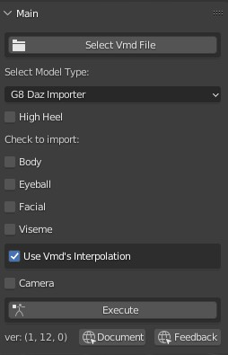
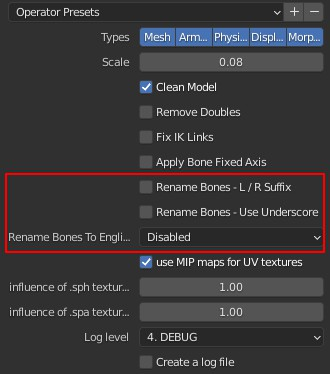

# Blender扩展: Vmd Retargeting
本扩展能够导入mmd的vmd数据到Daz或CC3模型而无须mmd模型，或通过mmd模型转换动作。  

 
  
中文界面  
  

# 演示视频
[https://youtu.be/Xgfu8oSjUUs](https://youtu.be/Xgfu8oSjUUs)  
  

# 基本信息
### 下载
[https://blendermarket.com/products/vmd-retargeting](https://blendermarket.com/products/vmd-retargeting)

### Blender 论坛
https://blenderartists.org/t/addon-retarget-mmds-vmd-motion-to-daz-or-cc3/1361902

### Github
github项目池用于交流反馈和多语言翻译  
[https://github.com/butaixianran/Blender-Vmd-Retargeting](https://github.com/butaixianran/Blender-Vmd-Retargeting)

### 版本
1.0

# 功能
* 导入vmd文件，无须mmd模型
* 或，从已经导入的mmd模型上转换动作数据
* 
* 分别导入身体、眼球、表情、口型或摄影机数据
* 当Daz/CC3模型有高跟鞋时，修正脚踝旋转
* 设置补间曲线和平滑出入
* 设置手臂旋转比例，以解决手臂穿入身体的问题  
* 设置相机偏移和旋转比例，以解决模型尺寸差异

# 安装
* 从本项目指定市场购买。比如，blender官方市场
* 然后打开blender，安装你获得的.zip文件
* 在扩展列表中，搜索 "Vmd retargeting" 进行启用  
* 在工作区域，按下N，显示侧边栏工具面板。在里面选择"Vmd Retarget"面板即可  

如果你不知道怎么给blender安装扩展，请网络搜索："blender 安装扩展"了解详情。

# 使用方法
## 准备模型
本扩展支持以下人模:
* Daz Genesis 8，由 [diffeomorphic daz importer addon](https://diffeomorphic.blogspot.com/) 导入
* CC3(Character Creator) 人模，由 [cc3 blender tools addon](https://github.com/soupday/cc3_blender_tools) 导入  

通过fbx文件导入的人模，cc3应该也没问题。但daz的，本扩展将无法转换表情。  

如果你希望使用于通过fbx导入的Daz模型，请告诉我们原因。如果原因合理，我们就会添加对fbx的Daz的支持。  

### 准备CC3模型
无须准备

### 准备Daz模型
Diffeomorphic的daz importer强大而复杂。但这里只需要点击几个按钮即可。  

首先，你需要了解它基本使用方法，如何在Daz Studio准备一个模型用于导出给Diffeomorphic daz importer用。
这个请查看该扩展的官方教程。如果不愿意看英文，请搜索："Diffeomorphic daz blender 导入"查看中文教程。  

然后，当要导入模型到blender时，你需要3个东西:
* 合并所有骨架到人模身体骨架
* Face Unit 和 Viseme 的Morph变形
* 让所有骨骼可以调整（Make all bone poseable）  

**最简单的实现方法是，点击："Easy Import Daz"按钮**  
默认，它已经帮你勾选了"Merge Rigs"。所以，你只需勾选："Face Units" 和 "Visemes"，然后点击导入即可。  

导入后，前往Diffeomorphic daz importer扩展的： "**Finish**" 部分，点击"**Make All Bones Poseable**"  
  
准备完毕。

## 准备一个vmd文件
一般来说，无须额外操作。  

但是，有少数老旧或特殊vmd文件，不使用通常的TDA骨骼名字或文件结构。  

如果直接导入这种vmd文件到Daz或CC3人模，会出现像机器舞一样，从一个姿势跳到另一个姿势的现象。  

对于这种vmd文件，只需要打开MikuMikuDance，加载一个TDA模型，加载这个动作，然后导出为新的vmd文件。  

这个新的vmd文件，将能够正常使用。

## 导入vmd动作
相当简单：
* 选择人模骨架
* 选择vmd文件
* 选择人模类型(CC3 or Daz)
* 勾选要导入的部分
* 确保你当前选择的模型是Daz或CC3，点击 "Execute", 完成.

每个部分，都会导入为一个action，并包装为一个strip，放到一条新轨道上。可在NLA(Nonlinear Animation)中查看  

这样，这些动作就不会弄乱你的时间线，你还可以像剪辑块一样，整体移动或删除他们。  

## 选项
移动鼠标到面板的各个控件上，会显示一个有用的提示。比如：  

高跟鞋的提示：  
  

摄像机偏移的提示：  
  

### 高跟鞋
勾选后将无视vmd的脚踝旋转。  

### 身体动作
#### 轨道
身体动作被分开放在多条轨道上。  

原因比如，mmd不支持分层运动。因此，会用多个效果相同的骨骼，来模拟分层运动。对于这种情况，我们是把对应骨骼的运动，放到一个真正的新轨道上。

目前，我们仅处理：center骨骼和groove骨骼的移动  

#### IK
CC3和Daz模型默认没有IK。因此本扩展在从vmd文件导入身体运动时，会创建IK  

从mmd模型上转换动作数据时，则不需要IK。  

#### 超过180度的旋转
MikuMikuDance里，把旋转180度和-180度当作一回事。于是，一个骨骼带有一个旋转170度的关键帧 和 另一个-170度的关键帧，不会在两帧之间旋转340度，而是旋转20度。    

对于Blender，这就是个问题。  

本扩展处理了一部分这种问题，但并没有全部处理。因此，如果你的模型，旋转方向和mmd的不一样，你可能需要通过从mmd模型上转换数据，而不是直接导入vmd文件。这样，本扩展会转换每一帧，而不只是关键帧。因此，就没有这种问题了。  

#### 手臂旋转比例
Daz/CC3人模的手长和mmd人模不同。因此，如果mmd人模将手放到胸口，在Daz/CC3人模上手必然就会穿入身体。  

设置前手臂旋转比例为0.8一般能够解决这个问题。  

手臂旋转比例，只对直接导入vmd文件有效。  

#### 选择一个mmd模型作为数据源
如果你选择了一个mmd模型作为数据源，本扩展在导入身体运动时，就会忽视你选择的vmd文件，而从你指定的mmd模型上转换身体运动。  

眼球和表情口型，还是会从vmd文件读取。  

你需要blender mmd tools来导入一个mmd模型到blender：  
[https://github.com/UuuNyaa/blender_mmd_tools](https://github.com/UuuNyaa/blender_mmd_tools)  

**导入mmd模型时，取消勾选骨骼重命名！** 我们使用原日文骨骼名称来映射骨骼。    
  

**然后，用mmd tools导入vmd动作到你的mmd模型，而不是用本扩展。** 方法如下：  
选中mmd模型，前往`文件菜单->import->vmd file`选择一个vmd文件。  
现在，mmd模型上，应该有了动作数据。  
然后，选择你的daz或cc3模型，在本扩展的"Source"(源)部分，使用吸管选择器，选择这个mmd模型的骨架作为源。**注意，不要选择它的空父亲对象**   
  

最后，确保当前选择的骨架是Daz或CC3模型，点击"Execute"。  

这样就会转换映射过的骨骼上的每一帧，而不只是关键帧，所以速度会非常慢。  

这种方式，不需要给Daz/CC3添加Ik骨骼  

**我们为此制作了一个单独的视频教程：**  
[https://youtu.be/rttA3v_5S2I](https://youtu.be/rttA3v_5S2I)  

### 眼球/表情/口型
CC3人模没有口型morph，这是iclone的功能。因此，本扩展用表情morph来模拟口型。虽然可用，但不会像真正的口型morph那么好，而且牙齿也不会动。  

### 补间曲线和平滑
你可以从这里找到示例图： [https://easings.net/](https://easings.net/)  

这个设置不会影响摄像机。摄像机运动永远是线性的。  

### 摄像机旋转比例和高度偏移
Daz/CC3人模和mmd模型的尺寸不同。因此，摄像机需要调整   

默认值大部分时候工作的很好。  
但如果你的CC3人模穿了高跟鞋，你可能需要往上移动摄像机高度8厘米。  

### 调试模式
调试模式会在控制台窗口显示一切。因此会导致导入数据非常慢。  

只在导入只有一个姿势的vmd文件时，再勾选调试模式。  

# 局限性
## 肩膀旋转
mmd模型有3个肩膀骨骼：肩, 肩P, 肩C。本扩展无视了肩P和肩C。  

## 扭曲骨骼(Twist Bone)
MMD模型也带有扭曲骨骼。但只有很少的vmd文件会使用。在直接导入vmd文件时，不会处理它们。  

因此，对于用了这种骨骼的vmd文件，你需要通过一个mmd模型来转换动作。  

## 道具运动
本扩展不会处理。  

