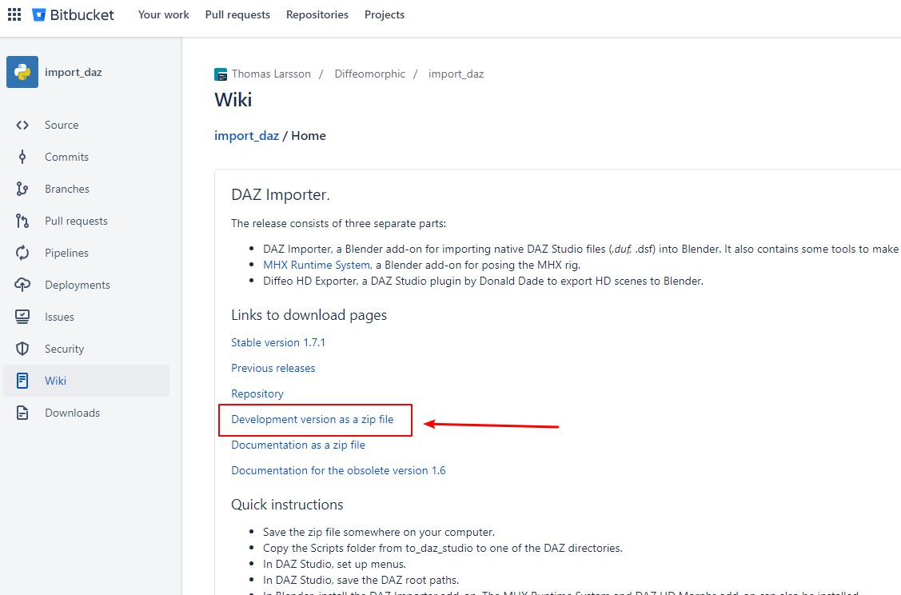
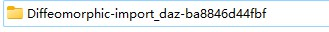

# Diffeomorphic daz importer 基本说明
## 介绍
把Daz的人模，姿势，场景，灯光等，导入Blender。这是非官方的插件，但是比官方更新的更加勤快，功能也更加强大。   

## 下载
官网：  
[https://bitbucket.org/Diffeomorphic/import_daz/wiki/Home](hhttps://bitbucket.org/Diffeomorphic/import_daz/wiki/Home)  

直接下载地址页面：  
[https://www.dropbox.com/s/7mj32wh3bnn4rwe/import_daz_mhx_rts_v1_7_1.zip](https://www.dropbox.com/s/7mj32wh3bnn4rwe/import_daz_mhx_rts_v1_7_1.zip)  

打开后，点击页面左上角的"下载"按钮，把整个分享目录下载下来。   

### Blender 4.x
这个扩展，要用于Blender 4.x，必须下载他的最新开发版本。dropbox上的稳定版是老版本，只适合Blender 3.x，无法用于Blender 4.x.   
[https://bitbucket.org/Diffeomorphic/import_daz/wiki/Home](https://bitbucket.org/Diffeomorphic/import_daz/wiki/Home)   

  

解压下载的文件，目录名字应该类似"Diffeomorphic-import_daz-xxxxxxxxxx"。   
  

重命名这个文件夹为"import_daz"，打包成新的zip文件。然后把这个新的zip文件，作为Blenderk扩展安装。这样，你就有了最新版的**diffeomorphic daz importer**，可以用于Blender 4.x。  

# 安装及使用
## 简述版
1. 解压下载的zip文件
2. 从"import_daz"目录下的"to_daz_studio"目录中，复制"Scripts"目录，到Daz内容库中
3. 在Daz Studio中，前往Content Library->Script->Diffeomorphic，运行Set up menu，然后运行Daz root paths，导出路径json文件
4. 对Blender，安装"import_daz"这个扩展
5. 前往扩展面板的"Global Settings"，点击左下角"Load Root Paths"，导入之前导出的路径文件
6. 在Daz中，保存场景为".duf"文件
7. 点击文件菜单的"Export to Blender"，保存.dbz文件到.duf文件同名同目录下（**每次保存Daz模型，都要重新导出.dbz文件**）  
8. Blender中，扩展面板点击"Import Daz"，导入刚才的.duf文件。  

## 详细版
### 安装
#### 放置文件
下载的zip解压之后，一共有3个目录，只看"import_daz"这个目录，其他两个不用管。    

进去之后，里面有个"to_daz_studio"的目录，继续进入，把里面的"Scripts"目录，剪切到你的Daz的库中。Daz的库中，应该也有个Script目录，这个目录会合并进去。  

然后，回到"import_daz"这个目录外层，把"import_daz"这个目录，复制到你的Blender的扩展目录下。Blender扩展目录一般在：  
`%appdata%\Blender Foundation\Blender\3.0\scripts\addons`   
把"3.0"换成你的blender版本号。  

#### 配置Daz Studio
打开Daz Studio，前往Content Library面板，展开Script目录，进入"Diffeomorphic"这个文件夹。双击："Setup Menus"脚本。   

这个脚本，会在你的Daz的File菜单里，添加"Export To Blender"这个菜单项。**HD那个不要用。**    

接下来，点击"Save Paths"这个脚本，保存你的库的路径的json文件。  

Daz 配置完毕。  

#### 配置Blender
打开Blender，前往菜单：Edit->Preferences->Add-ons  
在里面搜索："Daz"  
勾选：`Imprt-Export: Daz(.duf, .dsf) importer`

回到工作区域，按下N，打开右侧工具面板。前往："Daz Importer"面板。点击"Global Settings"按钮，打开全局设置面板。   

点击面板左下角的：Load Root Paths，导入之前在Daz保存的路径json文件。  

查看面板左上角的 Content Directories里面的路径，是不是你的Daz内容库的根路径，是的话，到此就设置完毕了。  

**可选设置：**    
面板右上角：Materials 设置中，Method一栏。如果你习惯使用eevee，这里请选：Principled。不然皮肤颜色和眼睛透明度在eevee下会有问题。  

Blender配置完毕。  

### 基本使用
在Daz中，保存场景为.duf文件。  

前往文件菜单，点击："Export to Blender"（**HD那个不要用**），保存一个后缀 `.dbz` 的json文件。文件名和路径要和场景的 `.duf` 文件相同。（默认即可）（**每次保存Daz模型，都要重新导出.dbz文件**）    

前往Blender，工作区按N，前往这个扩展的面板。  

点击"Import Daz"按钮，选择刚才保存的".duf"文件即可。  

# 进阶选项
请参考官方文档，这里只提供基本使用方法  

